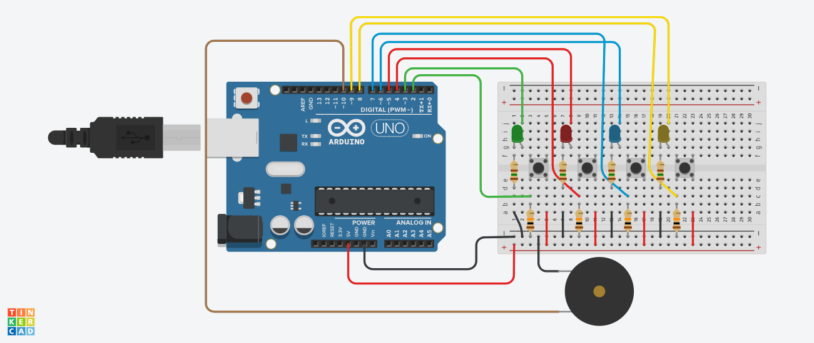
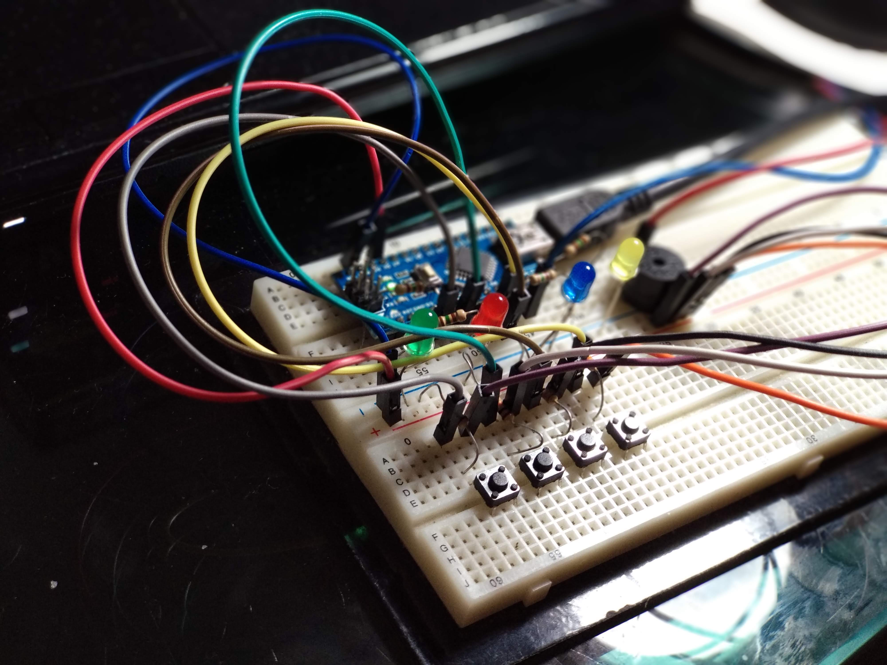

# OpenGenius: the game
---
#### A DIY Genius game version built on Arduino.
---
## You'll need...
+ 1x Arduino (any version);
+ 1x Breadboard;
+ 4x 150R resistors;
+ 4x 10K resistors;
+ 1x Green LED;
+ 1x Red LED;
+ 1x Blue LED; 
+ 1x Yellow LED;  
+ 4x Push-buttons;
+ 1x Buzzer;
+ Wires to connect the components;
---
## Schematic

Schematic designed on Tinkercad.

Real circuit.